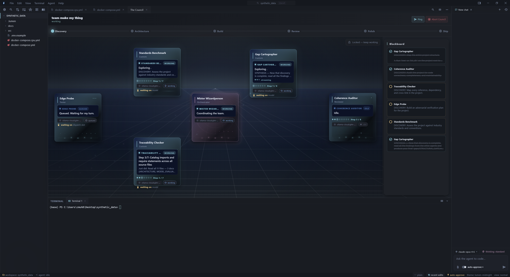
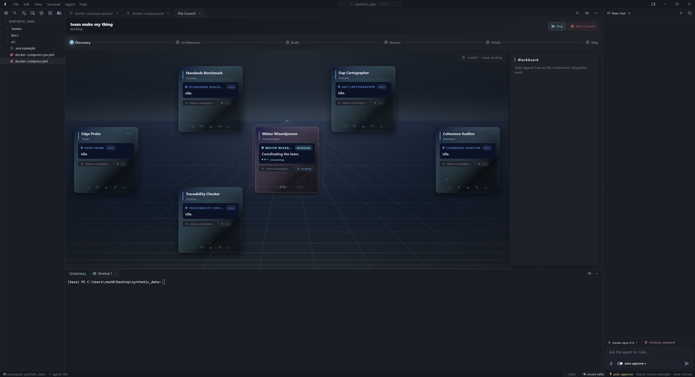
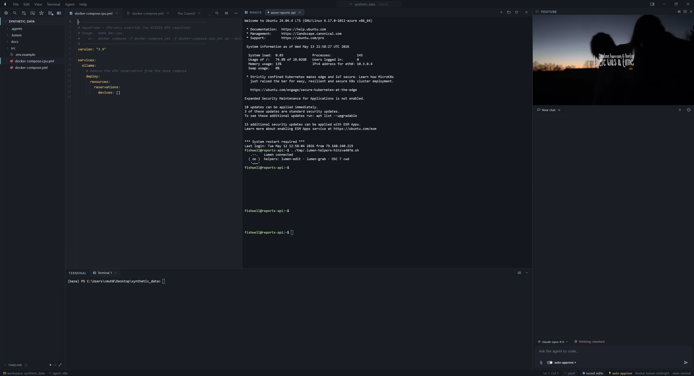
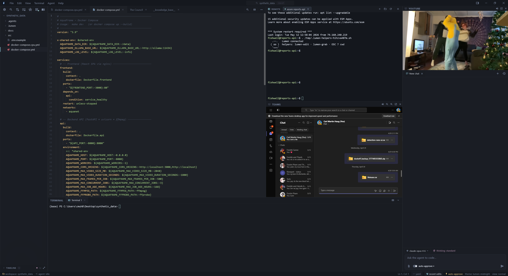

<h1 align="center">Lumen</h1>

<p align="center">
  <strong>Editor, terminal, SSH, agent. One window.</strong>
</p>

<p align="center">
  Plus a file explorer, Teams, YouTube, and Twitch &mdash; all docked alongside. Open it tomorrow and you&rsquo;re back where you stopped.
</p>

<p align="center">
  <a href="https://lumen-mu-seven.vercel.app/"><strong>Website</strong></a> &nbsp;·&nbsp;
  <a href="https://github.com/haviduck/lumen/releases"><strong>Download</strong></a> &nbsp;·&nbsp;
  <a href="https://github.com/haviduck/lumen/issues"><strong>Issues</strong></a>
</p>

<p align="center"><sub>Solo project. Built with Flutter for Windows. Mac/Linux scaffolding compiles but i don't ship binaries for them yet.</sub></p>



## Why this exists

I kept alt-tabbing between Cursor, a terminal, an SSH session, Teams for work chat, and a YouTube/Twitch tab on the second screen. The context-switch tax got annoying enough that i wrote my own thing.

Lumen is also the playground i use to figure out what an agentic IDE actually wants to feel like when the model is wrong half the time and you still need to ship.

## At a glance

- **One window** — editor, terminal, SSH, agent chat, Teams, YouTube, Twitch, GitHub, all docked, workspace-scoped tab state.
- **Bring-your-own-model** — Ollama (local, free), Claude, Gemini, Copilot, any OpenAI-compatible endpoint. Multiple providers at once, switch per-chat.
- **Council mode** — multi-agent orchestrated deep work. Architect, researcher, tester, reviewer running through real phases, sharing a blackboard.
- **Real SSH** — vaulted hosts (OS keystore, not plaintext json), in-IDE terminal, drag-drop SFTP, edit-remote-files-on-save. Walled off from the agent by default.
- **Inline agent diffs** — every file the agent edits gets accept/revoke decorations. You stage turn-by-turn before changes hit disk.
- **Persistent memory** — per-workspace skills, rules, and a knowledgebase that auto-injects into every system prompt. Six-month projects survive.
- **File timeline** — every change captured to a content-addressed journal. "Go back to before the agent broke this" is one click.
- **Auto-update** — quiet, SHA-256 verified, runs while you're not looking.

## Install

Windows is the supported platform today. Two flavours from the [releases page](https://github.com/haviduck/lumen/releases):

**Installer (recommended).** Download `Lumen-Setup-vX.Y.Z.exe`. SmartScreen will warn — Lumen isn't code-signed yet. Click **More info → Run anyway**. Installs per-user at `%LOCALAPPDATA%\Programs\Lumen\`. No admin / UAC needed. Clean uninstall via Apps & Features. Auto-updates from the menu bar.

**Portable zip.** Download `lumen-vX.Y.Z-windows-x64.zip`, extract, run `lumen.exe`. No auto-update — grab the next zip manually.

### First run

A wizard walks you through picking at least one LLM provider — Ollama if you want local and free, or any of the cloud ones. You can skip and configure later from **Help → Setup Wizard…** or Settings.

At least one provider has to be configured for chat, chat summaries, and skill generation to work. Everything else (editor, file explorer, terminal, SSH, Teams, YouTube) runs fine without any LLM.

## What's in the box

### Editor

Multi-tab, syntax-highlighted, with markdown preview, drag/drop file moves, Git ignore badges, and undo/redo across explorer operations.

Files the agent touches get inline accept/revoke decorations — you stage changes turn-by-turn before they hit disk as final. Anything past the agent decoration is captured in the file timeline (see below), so even "approved" edits stay one click away from undo.

### Agent chat — bring your own model

| Provider | Notes |
|---|---|
| **Ollama** | Local, no API key, free. Local daemon health-checked, with a one-click "open setup" banner if it's down. No silent failures. |
| **Ollama Cloud** | Same protocol, hosted. |
| **Anthropic** (Claude) | API key. |
| **Gemini** | Google AI Studio API key. |
| **GitHub Copilot** | Uses your existing Copilot subscription via the CLI. Sign in once. |
| **OpenAI-compatible** | Any endpoint matching OpenAI's chat-completions schema. xAI, Mistral La Plateforme, Together, local gateways, you name it. |

The composer has chip-based file/folder references, image attachments + clipboard paste, prompt queueing, and per-tool approval. Tool approvals are **persisted per-command**, so you only approve `pip install` once.

### Council mode — orchestrated multi-agent work

> The visual layer is theater. The orchestration underneath is real.

You give it a brief, it builds a team (architect, researcher, tester, reviewer, etc.), assigns roles, and runs them through **Discovery → Architecture → Build → Review → Polish/Ship** phases with a quality gate and a one-shot adversarial critic at the end.

Every agent has its own model, its own system prompt, its own tool budget. The orchestrator routes mentions and subtasks through a shared blackboard. Sessions are persisted and browsable after the fact.


<sub>Council mode at rest. Phase strip across the top, blackboard on the right, each agent has its own card with a step counter waiting for a brief.</sub>

### SSH + Remote — a real layer, not a plugin

- **Vaulted hosts.** Labels, addresses, fingerprints, and key paths in `SharedPreferences` for fast cold reads. **Passwords and key passphrases in the OS keystore** (DPAPI on Windows, Keychain on macOS, libsecret on Linux). Nothing in a plaintext `.json` you'll forget about.
- **Real terminal.** xterm-based session, OSC-7 cwd tracking, on-connect helper install (`lumen-edit`, `lumen-grab`, OSC-7 glue) so the IDE knows where you are remotely.
- **SFTP browser.** Modal browser that walks the remote filesystem from your OSC-7 cwd. Breadcrumb nav, hidden-file toggle, direct-open into the editor.
- **Drag-and-drop upload.** Drop a local file onto the Remote pane and it uploads via SFTP on the active session. Virtual drags from WinRAR / 7-Zip / Gmail web work.
- **Remote-edit-on-save.** Open a remote file, edit it locally, hit `Ctrl+S`. The diff is pushed back over the existing SFTP channel. No re-prompt for credentials, no separate tool.

> **Agent has zero access to SSH.** It can't see hosts, read keys, open sessions, or run remote commands. Hard boundary, not advisory. Full reasoning + roadmap in [the SSH safety section](#ssh--the-agent--what-it-can-and-cannot-do) below.


<sub>Editor on the left, SSH in the middle, a YouTube panel on the right. Don't pretend you don't do this.</sub>

### Side panes — the alt-tab killers

Right-side dock hosts webviews:

- **Microsoft Teams** — full webview, sign-in works, channels/chats/calls all there. Keep work chat docked next to the editor.
- **YouTube** — embedded player with workspace-scoped tab state. Auto-routes to the chat pane when SSH or Teams is using the main side slot, so audio keeps going.
- **Twitch** — same treatment.
- **GitHub** — for casual browsing without leaving the IDE.

> Yes it's a chromium-on-chromium pile. No i don't care, it's faster than alt-tabbing.


<sub>Editor on the left, SSH and Teams in the middle column, YouTube on the right. One window.</sub>

### Workspace skills, rules &amp; knowledgebase

Every workspace gets `.lumen/` and `.agents/` folders of LLM-facing context:

- **`.lumen/skills/`** — reusable skill files the agent can call. Auto-generated from your project's README on first run if you opt in.
- **`.lumen/rules.md`** — silently injected into every system prompt at workspace + global scope. Project conventions live here: _"always run `flutter analyze` after edits"_, _"the API folder is in `services/`, not `lib/`"_. The global rule out of the box already teaches agents how the knowledgebase works.
- **`.agents/knowledgebase.md`** — the workspace knowledgebase, surfaced as a synthetic editor tab (**Knowledge Base** in the open-files row). Persistent memory between chat sessions. Auto-injected into the system prompt on every turn; the agent is instructed to keep it current. Auto-summarize button if it grows too large.

The trio is what makes a long-running agent project survivable — you don't re-explain your codebase every chat.

### File timeline — revision history for everything

Every meaningful file mutation goes into a content-addressed blob store + append-only journal under `<app-support>/lumen/timeline/<workspace>/`:

- **Agent tool ops** — every `EDIT_FILE` / `MULTI_EDIT` / `WRITE_FILE` the agent runs, with `(sessionId, turnId, messageId)` correlation IDs.
- **Manual saves** — your `Ctrl+S` writes.
- **External FS writes** — files changed by other tools while Lumen is running.
- **Explorer actions** — rename, move, delete via the file tree.

Scroll the Timeline rail, diff against any past version, restore in one click. Because every entry carries the agent correlation IDs, **"go back to before the agent broke this"** is one click. A future "click a chat message → restore everything since" flow is wired structurally; the UI just isn't shipped yet.

Same-hash content blobs are reused, so the journal doesn't bloat from formatter passes re-saving the same bytes.

### Remote control (mobile/web)

A PWA under `assets/remote_app/` runs on phone/tablet and connects back to Lumen over the LAN. Read chat history, send prompts, watch the agent work from the couch. Useful when you've kicked off a long council session and want to check in from the kitchen.

### Auto-update

Lumen polls the GitHub Releases API once per 12 hours, surfaces an **Update available** pill in the menu bar when there's something new. On click it downloads the next installer to `%TEMP%`, closes itself via Restart Manager, runs the silent installer, and reopens. SHA-256 verified if the release asset carries a digest.

Force a check from **Help → Check for Updates**.

## Honesty about what's WIP

> Solo project, shipped fast. A few things are exposed in the UI but not fully wired up.

- **Some Settings pages are scaffolds.** Advanced agent tuning, certain provider sub-toggles, theming knobs — they render but don't always persist or propagate. If a setting doesn't seem to do anything, that's why. The actively-used surfaces (chat models, LLM providers, SSH vault, tools, rules, knowledgebase) all work.
- **macOS / Linux builds** — Flutter compiles, but i don't run platform QA. Expect rough edges.
- **Tablet / phone PWA remote** — works for chat read-out and prompt-send today, but it's not a full IDE remote. Editor / file-explorer / terminal aren't piped through.
- **One-click turn restore** — the timeline captures the correlation IDs (`sessionId`, `turnId`, `messageId`) for every agent edit, but the "revert this whole turn" UI isn't shipped yet. Today you restore per-file via the timeline rail.
- **Code signing** — installer is unsigned, SmartScreen will warn on first download.

If something behaves weird, [file an issue](https://github.com/haviduck/lumen/issues) and i'll look at it. WIP doesn't mean ignored, it means "the wiring is half-done and i haven't pushed the fix yet."

## Contributing

Lumen is a one-person project so far and there's a lot of surface area for things to be wrong on. **Bug reports with steps to reproduce are gold.** Feature ideas welcome too.

Specific places where help would move the needle:

- **Code signing.** I'd love to drop the SmartScreen warning. If you know the SignPath OSS path or have an extra OV cert lying around, get in touch.
- **macOS and Linux builds.** The Flutter scaffolding is there, i just don't have the cycles to do platform QA across all three. If you run mac or linux and want to try it, PRs welcome.
- **More provider integrations.** OpenAI-compatible covers a lot but there are edges. xAI, Mistral La Plateforme, Together, anything you'd want native handling for.
- **Workspace skills.** The `.lumen/skills/` directory is a fairly new surface. Good shared skills (linters, framework-specific helpers, project bootstrap) would make a big difference.
- **Settings finishing pass.** Half the unmarked WIP toggles in Settings need their persistence + propagation wired through. Boring grunt work, high value.
- **PWA remote parity.** The mobile remote can do chat today; piping the editor / file tree / terminal through over the LAN would be a fun project.
- **Translations.** All UI strings live in `lib/l10n/strings.dart`. Currently English-only.

If you want to dig in, **`.agents/knowledgebase.md` is the router** — it points at every other doc in `.agents/` (design system, conventions, landmines, roadmap). Start there.

## Build from source

Standard Flutter Windows build:

```powershell
git clone https://github.com/haviduck/lumen.git
cd lumen
flutter pub get
flutter run -d windows
```

Release build:

```powershell
flutter build windows --release
```

Installer build (needs [Inno Setup 6 or 7](https://jrsoftware.org/isdl.php)):

```powershell
.\tools\installer\build.ps1
```

Outputs `dist\Lumen-Setup-vX.Y.Z.exe` + `dist\lumen-vX.Y.Z-windows-x64.zip`. Both get uploaded to the GitHub release — the installer name is regex-matched by the auto-updater, so don't rename it.

**Requirements:** Flutter SDK, Visual Studio Build Tools with the C++ workload, Inno Setup if you want the installer. `flutter doctor` will tell you what's missing.

## SSH + the agent — what it can and cannot do

Lumen ships an SSH integration (vaulted hosts, in-IDE Remote terminal, drag-drop SFTP, remote-edit-on-save). When you also use the agent chat, you reasonably want to know how the two interact.

**Today, by design, the agent has no direct access to the SSH layer.** The boundary is hard, not advisory:

- The agent **cannot** read your vaulted host list, fingerprints, passwords, key passphrases, or private key paths. Secrets live in the OS keystore; host metadata in `SharedPreferences`. Neither is exposed to any agent tool.
- The agent **cannot** open, control, or read a live SSH session. Connections are owned by `SshController` and only surfaced to the user-facing Remote pane.
- The agent **cannot** SFTP files, edit remote-mirrored buffers without going through the same approval flow as local edits, or trigger a host-key trust prompt.
- The agent **cannot** see that an SSH session exists. `SshController` is not in the tool registry. As far as the model is concerned, there is no SSH layer.

This is a security choice. SSH credentials and active connections give an attacker arbitrary remote command execution under your identity. Routing an LLM near them — even with approval prompts — opens a class of "the model misread your intent and ran `rm -rf` on prod" failures that i don't think the convenience is worth right now.

**On the roadmap** (each will land behind a Settings → Tools toggle, default-off, with an approval card on first invocation):

- "Run command in the *currently active* SSH session" — gated by per-command approval, session selected by you in the Remote pane, never by the agent.
- "Read remote file via the active session's SFTP channel" — read-only, size-capped, uses your already-authenticated connection.
- "Write to a remote-mirror buffer you have open" — equivalent to the agent editing a local file you opened; goes through the same `EDIT_FILE` approval surface.

**Explicitly NOT on the roadmap:**

- Agent-initiated `connect` to a vaulted host.
- Agent access to passwords, passphrases, or key material of any kind.
- Agent modification of the vault.

For agent reach over SSH today, the supported pattern is: connect manually in the Remote pane, run the commands you want manually, copy outputs into chat from the terminal. The roadmap items will narrow that gap incrementally.

## Project layout

```
lib/                 # Flutter app code
  providers/         # shared state and controllers
  services/          # integrations, persistence, tool execution
  widgets/           # editor, chat, file explorer, terminal, settings
  theme/             # palette + motion + glass tokens
  l10n/              # all UI strings
assets/              # icons, the remote PWA, the ublock-lite extension
windows/  linux/  macos/  android/  ios/      # Flutter platform scaffolding
tools/installer/     # Inno Setup script + PowerShell build wrapper
website/             # marketing + docs site (deployed to Vercel)
.agents/             # design notes, conventions, landmines, roadmap
```

Runtime data lives in `.lumen/`, `.agents/`, `.dart_tool/`, `build/` — all gitignored.

## Notes

Some integrations (Copilot CLI, Ollama, Teams sign-in) need local services or accounts. Everything degrades gracefully — if a provider isn't configured, its features are hidden, not broken.

No telemetry. There is no Lumen server.
